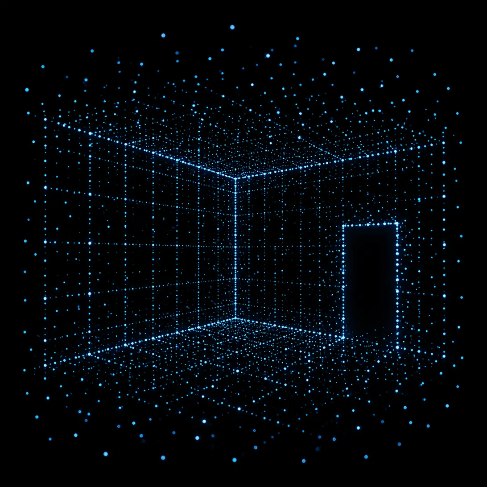

NightVision - See in the dark
=====

Augment your senses.

All Apple goggles emit and can see infrared light. This lets it see walls & objects, even when the normal light visible to us is low.

The NightVision app unlocks this capability for you too.

Adjust the intensity to your preference.
